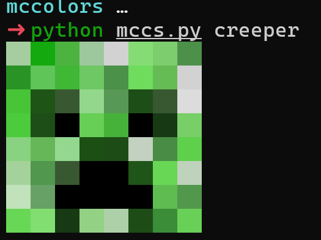
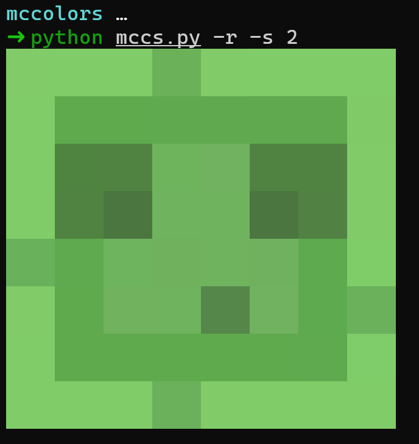

[中文](README_zh.md)

# MC-colorscripts

**MC-colorscripts** is a CLI utility that prints an image of Minecraft to the terminal. This tool offers a fun and creative way to display Minecraft-related ASCII art directly in your terminal.


### Gallery





### Features

* Print Minecraft images, including blocks and entities.
* Optionally scale the output for better viewing.
* Randomly select an ASCII art file from the available collection.
* Supports colored output via ANSI escape codes.

> **Note:**  The tool is still under development. Future updates will add more categories such as blocks, entities, and additional art styles. Some proportions might not be consistent across all images.

### Installation

Clone the repository and ensure you have Python 3 installed. Then, add execute permission to the script:

```bash
git clone https://github.com/yourusername/MC-colorscripts.git
cd MC-colorscripts
```

Make sure that the `colorscripts` folder (containing your ASCII art files) is located in the same directory as the `mccs` script.

### Usage

Run the tool from the command line:

```bash
python mccs.py [options] [name]
```

**Options:**

* `-l, --list`     List all available ASCII art files.
* `-s, --scale`    Set the output scaling factor (default is 1).
* `-r, --random`   Randomly select an ASCII art file to print.
* `name`          Specify the name of the ASCII art file to print (without extension).

### License

This project is licensed under the [MIT](LICENSE) License.
