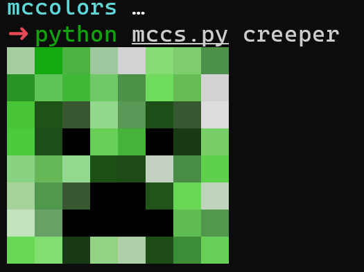
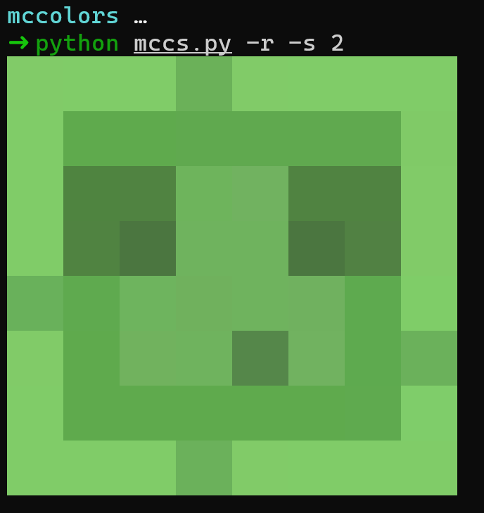

# MC-colorscripts

**MC-colorscripts** 是一个命令行工具，可在终端中打印 Minecraft 的图片。该工具为你提供了一种有趣且富有创意的方式，在终端中展示与 Minecraft 相关的 ASCII 字符画。

### 示例





### 特性

* 显示 Minecraft 图片，包括方块和实体等。
* 支持可选的输出缩放，方便查看。
* 支持随机选择 ASCII 文件进行显示。
* 使用 ANSI 转义码实现彩色输出。

> **注意：**  该工具目前仍处于开发阶段。未来将增加更多分类，如方块、实体以及更多艺术风格。部分图片的比例可能存在不统一的情况。

### 安装

克隆仓库并确保你已安装 Python 3。然后，为脚本添加执行权限：

```bash
git clone https://github.com/yourusername/MC-colorscripts.git
cd MC-colorscripts
```

确保 `colorscripts` 文件夹（包含你的 ASCII 字符画文件）与 `mccs` 脚本位于同一目录下。

### 用法

在命令行中运行该工具：

```bash
python mccs.py [选项] [文件名]
```

**选项：**

* `-l, --list`     列出所有可用的 ASCII 文件。
* `-s, --scale`    设置输出的缩放倍数（默认为 1，不缩放）。
* `-r, --random`   随机选择一个 ASCII 文件进行显示。
* `文件名`        指定要显示的 ASCII 文件名称（不含扩展名）。

### 协议

该项目遵循 [MIT](LICENSE) 协议。
